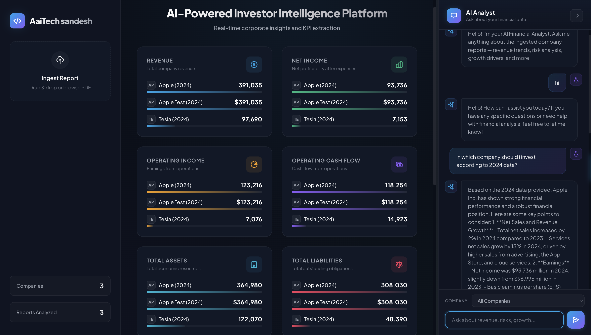
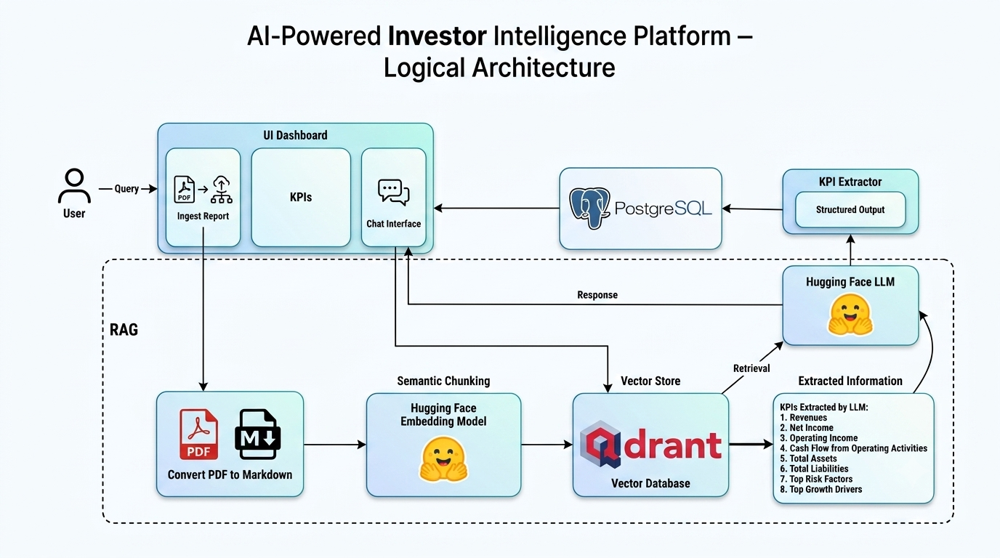

# 🚀 AI-Powered Investor Intelligence Platform

An AI-powered financial intelligence platform that automatically extracts, analyzes, and visualizes key financial metrics from complex investor documents such as **10-K filings and quarterly reports**.

The platform combines **document processing, semantic retrieval, vector search, structured LLM extraction, PostgreSQL, and an interactive dashboard** to transform unstructured financial reports into structured, queryable financial insights.

---

## 🎯 Problem Statement

Financial reports such as annual and quarterly filings can contain hundreds of pages of dense and unstructured information.

Manually extracting important financial metrics such as:

- Revenue
- Net income
- Operating income
- Cash flow
- Total assets
- Total liabilities
- Risk factors
- Growth drivers

is time-consuming, difficult to scale, and prone to human error.

This project addresses this problem by building an automated pipeline that:

1. Processes complex financial documents.
2. Converts unstructured documents into searchable semantic chunks.
3. Retrieves relevant information using vector similarity search.
4. Uses an LLM to extract structured financial metrics.
5. Stores extracted data in PostgreSQL.
6. Visualizes financial insights through an interactive dashboard.

---

## 🖥️ Dashboard



---


## 🛠️ Tech Stack & Logical Architecture

- **Backend Framework:** FastAPI & Uvicorn (Asynchronous REST API)
- **Vector Database:** Qdrant (Running locally via Docker for high-performance spatial search)
- **Relational Database:** PostgreSQL (Structured schema for persistent financial KPI data tracking)
- **Orchestration & RAG:** LangChain & Pydantic (Structured extraction via tool-calling blueprints)
- **Embeddings & LLM:** Hugging Face Inference API (`BAAI/bge-large-en` + `Mistral-7B-Instruct-v0.3`)
- **Package Manager:** `uv` by Astral (Lightning-fast Python environment setup)

### 🏗️ System Architecture Diagram
<!-- 
DIRECTIONS: Save your edited architecture diagram as "architecture.png" 
inside the "assets" folder, and it will render below automatically! 
-->



## System Workflow
The platform follows the following workflow:

```text
                    Financial PDF
                         │
                         ▼
                 Document Ingestion
                         │
                         ▼
                    PDF → Markdown
                         │
                         ▼
                   Semantic Chunking
                         │
                         ▼
                  Embedding Generation
                         │
                         ▼
                  Qdrant Vector Database
                         │
                         ▼
                  Semantic Retrieval
                         │
                         ▼
             LLM + Structured Pydantic Schema
                         │
                         ▼
                 Financial KPI Extraction
                         │
                         ▼
                      PostgreSQL
                         │
                         ▼
                       FastAPI
                         │
                         ▼
                 Interactive Dashboard

```


---
## 📁 Repository Structure

```text
├── app/                  # FastAPI Application Layers
│   └── routes/           # Routing engine (dashboard, chat, ingestion, health)
├── database/             # PostgreSQL database schemas and initialization hooks
├── ingestion/            # PDF parsing, markdown converters, and chunking worker engines
├── rag/                  # Core prompt engineering and KPI extraction business logic
├── vectorstore/          # Native Qdrant client connection setups and retrieval models
├── docs/               # Media elements (UI screenshots, system diagrams)
├── main.py               # Main application entry point
├── compose.yml           # Production Docker multi-container deployment manager
└── pyproject.toml        # Project dependencies managed by uv

```


## 📚 Technical Deep Dives & Documentation

For a closer look at the engineering decisions, core mathematical/architectural principles, and development hurdles behind this platform, check out the dedicated documentation modules:

*   **[Core System Concepts & RAG Theory](./docs/CONCEPTS.md):** A deep look into the semantic chunking algorithms, dense vector embedding models (`BAAI/bge-large-en`), and how structured tool-calling pipelines function.
*   **[Engineering Challenges & Lessons Learned](./docs/CHALLENGES.md):** An overview of the concrete technical roadblocks encountered during development—including managing native database payload transformations, overcoming Hugging Face LangChain serialization limitations, and debugging Python module shadowing.

*   **[UV Guide](./docs/NOTES.md)**


----

## ⚙️ Quick Start Guide

### 1. Prerequisites

Ensure you have the following installed on your machine:

- Python 3.12+
- Docker & Docker Compose
- Astral `uv` package manager

---

### 2. Environment Setup

Clone the repository and create your local environment file:

```bash
git clone https://github.com/yourusername/AI-Powered-Investor-Intelligence-Platform.git

cd AI-Powered-Investor-Intelligence-Platform

cp .env.example .env 
```

Open the .env file and add your Hugging Face Hub Access Token:

```HUGGINGFACE_API_KEY=your_huggingface_token```
------

### 3. Spin Up Infrastructure Databases

Launch the relational and vector databases using Docker Compose:

```
docker compose up -d postgres qdrant
```

This starts:

**PostgreSQL** — for storing structured financial metrics.

**Qdrant** — for storing document embeddings and performing vector similarity search.

---
### 4. Install Dependencies & Run the Application

Use uv to install and synchronize the project dependencies:

```
uv sync
```

Start the FastAPI web server:

```
uv run uvicorn main:app --reload --port 8000
```

Open your browser and navigate to:

```
http://localhost:8000
```

to access the live system dashboard.

---
## 📊 Core KPI Metrics Handled

The extraction layer uses structured **Pydantic schemas** to extract and normalize key financial information, including:

- **Net Revenue / Turnover**
- **Gross Profit Margins**
- **R&D Expenditure Rates**
- **Operating Cash Flows**
- **Total Assets and Liabilities**
- **Forward-looking Risk Summaries**
- **Growth Drivers**

## 📄 License

Distributed under the **MIT License**. See the `LICENSE` file for more information.